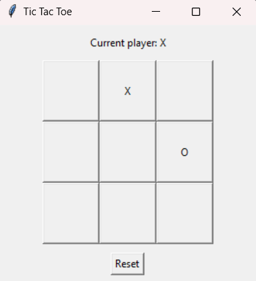

# Tic Tac Toe Game

This repository contains a Python-based implementation of the classic **Tic Tac Toe** game. It supports two modes:
1. **Console Mode**: Play via the terminal/console.
2. **Graphical User Interface (GUI) Mode**: A more interactive experience using a graphical interface powered by `tkinter`.

---

## Features

### Console Mode
- Play against a simple AI opponent.
- Choose your marker (`X` or `O`) and whether to go first.
- Randomized AI strategy with basic logic for selecting moves.
- Simple, text-based board visualization.

### GUI Mode
- Interactive board implemented with `tkinter`.
- Displays the current player and updates dynamically.
- Reset functionality to play multiple rounds.
- Automatic detection of winner or tie.

---

## Requirements
Ensure you have Python installed on your system. The game requires:
- `tkinter` (pre-installed with Python on most systems).

To check if `tkinter` is installed, run the following command in Python:
```python
import tkinter
```

---

## Installation
Clone the repository:
```bash
git clone https://github.com/Victor-M16/Python-Tic-tac-toe-game.git
cd Python-Tic-tac-toe-game
```

---

## How to Run

### Console Mode
Run the game from the terminal:
```bash
python main.py
```

### GUI Mode
Run the GUI version:
```bash
python gui.py
```

---

## Gameplay Instructions

### Console Mode
1. You'll be prompted to select your marker (`X` or `O`).
2. The game will randomly select who plays first.
3. Enter your moves by specifying the row and column (1-3 for both).
4. The game announces the winner or if it's a tie.

### GUI Mode
1. Launch the game to see the 3x3 grid.
2. Click on a cell to place your marker (`X` or `O`).
3. The game will indicate the current player and announce the winner or a tie.
4. Click **Reset** to start a new game.

---

## Example Screenshots

### Console Mode
```
   |   |   
-----------
   | X |   
-----------
   |   | O 
Your move
```

### GUI Mode


---

## Customization
Feel free to modify the code for:
- Enhancing the AI logic in `ComputerPlayer`.
- Improving GUI aesthetics in the `TicTacToe` class.
- Adding new features like multiplayer support or sound effects.

---

## Credits
This project was developed as a learning exercise following a tutorial. The implementation includes enhancements in logic and interactivity for both modes.

---

## License
This project is open-source and available under the MIT License.

